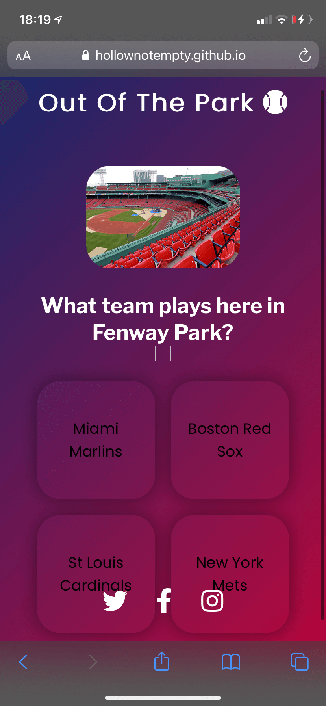

# Testing

To test the site, a sequence of steps were followed across various browsers and devices. The steps were as follow: 

 - Validate HTML and CSS using their respective validators.
 - All pages were checked to make sure that layout matched the [wireframes](https://www.dropbox.com/s/2ybowtp4rlgvrix/autonomix_wireframes.pdf?dl=0). 
 - All text was read through to be certain it was easy to read, understand and has no spelling or grammar errors.
 - Make sure that all images load in within a reasonable amount of time. 
 - Make sure correct page name is displayed in the tab (eg. Home | Autonomix.)

# User Stories 

The following are the steps I took to make sure the user stories listed in the [README.md](README.md/#UX) were fulfilled in the site:

*Numbers align with their respective User Story*

1. Pressing start on the home page starts a ten question quiz on baseball.
2. Four buttons appear underneath the question with possible answers.
3. The javascript file has 30 questions that randomize with every attempt at the quiz.
4. The quiz page simply contains the question and answer cards, without any other busy parts to the page.
5. After ten questions the users final score appears on the screen.

# Bugs

1. On mobile devices the answer buttons were displaying without a background colour. 

This was solved easily by declaring a background color in the css for the button. 

# Browsers

- Chrome
- Firefox
- Brave
- Safari
- Opera

# Devices

- ACER Computer monitor
- iPhone 11
- Macbook Pro 2018
- iPad 2
- iPad Mini